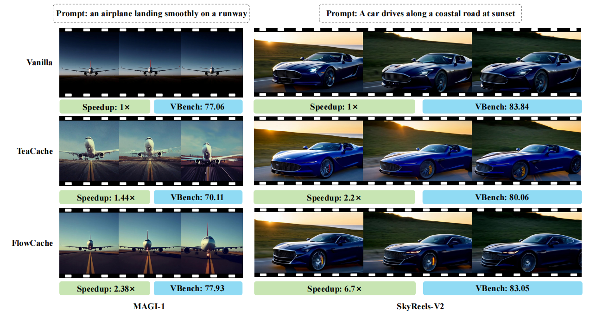
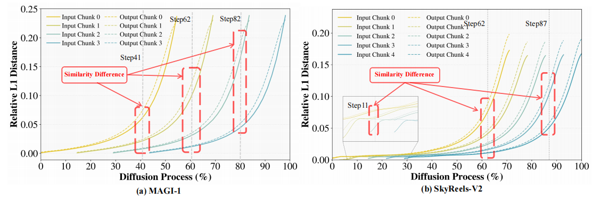
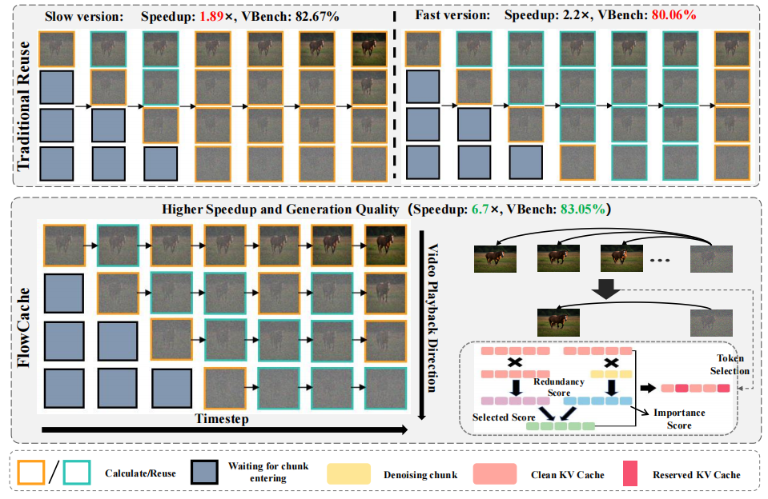
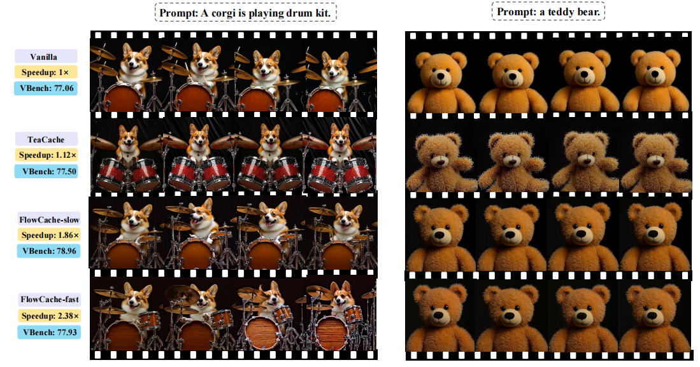
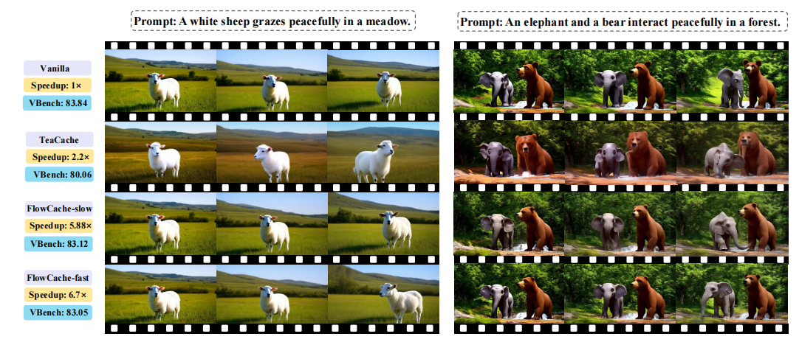

<div align="center">

<div align="center">
  
</div>

# 用于自回归视频生成的 Flow 缓存

### ICLR 2026

**[论文](https://openreview.net/forum?id=vko4DuhKbh)** | **[arXiv](https://arxiv.org/abs/2602.10825)** |

**首个专为自回归视频生成设计的缓存框架**

在几乎无画质退化的前提下，实现 **MAGI-1 上 2.38× 加速** 和 **SkyReels-V2 上 6.7× 加速**

[](LICENSE)
[](https://www.python.org/downloads/)
[](https://pytorch.org/)

</div>

## 📋 目录

- [新闻](#news)
- [概览](#overview)
- [方法](#method)
- [主要结果](#main-results)
- [安装](#installation)
- [快速开始](#quick-start)
- [支持的模型](#supported-models)
- [待办事项](#todo)
- [引用](#citation)
- [致谢](#acknowledgments)

---

<a id="news"></a>

## 📰 新闻

- 📄 **2026.02.12**：论文已上线 [arXiv](https://arxiv.org/abs/2602.10825)！
- 🚀 **2026.02.10**：发布 [MAGI-1](https://github.com/SandAI-org/MAGI-1) 与 [SkyReels-V2](https://github.com/SkyworkAI/SkyReels-V2) 的代码！
- 🎉 **2026.01.26**：论文被 ICLR 2026 接收！

---

<a id="overview"></a>

## 🌟 概览

FlowCache 是一个专为**自回归视频生成模型**设计的缓存框架。不同于将所有帧一视同仁的传统缓存方法，FlowCache 引入了**分块缓存策略**：每个视频块维护独立的缓存策略；同时结合**基于重要性的 KV 缓存压缩**，在保持生成质量的同时将显存占用控制在固定范围内。

<div align="center">
  
</div>

---

<a id="method"></a>

## 🔬 方法

### 关键发现

<div align="center">
  
</div>

我们的核心洞察是：即使在相同时间步下，不同视频块的去噪状态也存在显著异质性，因此需要独立的缓存策略才能获得最优性能。

### 框架概览

<div align="center">
  
</div>

FlowCache 为无需训练的自回归视频生成加速引入了三项关键创新：

- **分块去噪异质性（Chunkwise Denoising Heterogeneity）**：我们识别并形式化了不同视频块在同一时间步上的去噪进度差异，因此缓存决策应细化到每个分块。
- **分块自适应缓存（Chunkwise Adaptive Caching）**：每个分块根据自身相似度轨迹独立决定复用还是重算。
- **面向视频的 KV 缓存压缩（KV Cache Compression Tailored for Video）**：我们将“重要性-冗余”评分适配到自回归视频 KV 缓存压缩中，并引入高效且保持等价性的相似度计算，在不牺牲效率的前提下提升缓存多样性。

这些贡献共同使 FlowCache 成为首个具有理论支撑、无需训练、面向高效自回归视频生成的缓存框架。

更多细节请参阅原论文。

---

<a id="main-results"></a>

## 📊 主要结果

### 定量性能

#### MAGI-1（4.5B 模型）

| 方法 | PFLOPs | 加速比 | 时延 (s) | VBench | LPIPS | SSIM | PSNR |
|:------|:------:|:------:|:----------:|:-----:|:-----:|:----:|:----:|
| Vanilla | 306 | **1.0×** | 2873 | 77.06% | - | - | - |
| TeaCache-slow | 294 | 1.12× | 2579 | 77.50% | 0.6211 | 0.2801 | 13.26 |
| TeaCache-fast | 225 | 1.44× | 1998 | 70.11% | 0.8160 | 0.1138 | 8.94 |
| **FlowCache-slow** | 161 | **1.86×** | 1546 | **78.96%** | 0.3160 | 0.6497 | 22.34 |
| **FlowCache-fast** | 140 | **2.38×** | 1209 | **77.93%** | 0.4311 | 0.5140 | 19.27 |

#### SkyReels-V2（1.3B 模型）

| 方法 | PFLOPs | 加速比 | 时延 (s) | VBench | LPIPS | SSIM | PSNR |
|:------|:------:|:------:|:----------:|:-----:|:-----:|:----:|:----:|
| Vanilla | 113 | **1.0×** | 1540 | 83.84% | - | - | - |
| TeaCache-slow | 58 | 1.89× | 814 | 82.67% | 0.1472 | 0.7501 | 21.96 |
| TeaCache-fast | 49 | 2.2× | 686 | 80.06% | 0.3063 | 0.6121 | 18.39 |
| **FlowCache-slow** | 36 | **5.88×** | 262 | **83.12%** | 0.1225 | 0.7890 | 23.74 |
| **FlowCache-fast** | 28 | **6.7×** | 230 | **83.05%** | 0.1467 | 0.7635 | 22.95 |

---

### 可视化结果

<div align="center">
  
  
</div>

---

<a id="installation"></a>

## 🛠️ 安装

### 环境要求

- Python 3.8+
- CUDA 11.8+（或 12.x）
- PyTorch 2.0+

### MAGI-1 配置

```bash
cd FlowCache4MAGI-1
pip install -r requirements.txt
```

### SkyReels-V2 配置

```bash
cd FlowCache4SkyReels-V2
pip install -r requirements.txt
```

---

<a id="quick-start"></a>

## 🚀 快速开始

### MAGI-1

```bash
cd FlowCache4MAGI-1

bash scripts/single_run/flowcache_t2v.sh
```

### SkyReels-V2

```bash
cd FlowCache4SkyReels-V2

bash run_flowcache_fast.sh
```

---

<a id="supported-models"></a>

## 🎯 支持的模型

| 模型 | 类型 | 状态 |
|:------|:-----|:------:|
| **[MAGI-1](https://github.com/SandAI-org/MAGI-1)** | 4.5B-distill | ✅ |
| **[SkyReels-V2](https://github.com/SkyworkAI/SkyReels-V2)** | 1.3B | ✅ |

---

<a id="todo"></a>

## 📝 待办事项

- [ ] 支持更多自回归视频生成模型（如 self-forcing、causal-forcing 等）
- [ ] 集成其他无需训练的加速方法（如量化等）

---

<a id="citation"></a>

## 📚 引用

如果 FlowCache 对你的研究有帮助，请引用：

```bibtex
@misc{ma2026flowcachingautoregressivevideo,
      title={Flow caching for autoregressive video generation}, 
      author={Yuexiao Ma and Xuzhe Zheng and Jing Xu and Xiwei Xu and Feng Ling and Xiawu Zheng and Huafeng Kuang and Huixia Li and Xing Wang and Xuefeng Xiao and Fei Chao and Rongrong Ji},
      year={2026},
      eprint={2602.10825},
      archivePrefix={arXiv},
      primaryClass={cs.CV},
      url={https://arxiv.org/abs/2602.10825}, 
}
```

---

<a id="acknowledgments"></a>

## 🙏 致谢

感谢以下项目作者的宝贵贡献：

- [MAGI-1](https://github.com/SandAI-org/MAGI-1)
- [SkyReels-V2](https://github.com/SkyworkAI/SkyReels-V2)
- [TeaCache](https://github.com/ali-vilab/TeaCache)
- [R-KV](https://github.com/Zefan-Cai/R-KV)

---

<div align="center">

**⭐ 如果这个项目对你有帮助，欢迎点一个 Star！⭐**

如有问题或建议，欢迎在 GitHub 提交 issue。

</div>
